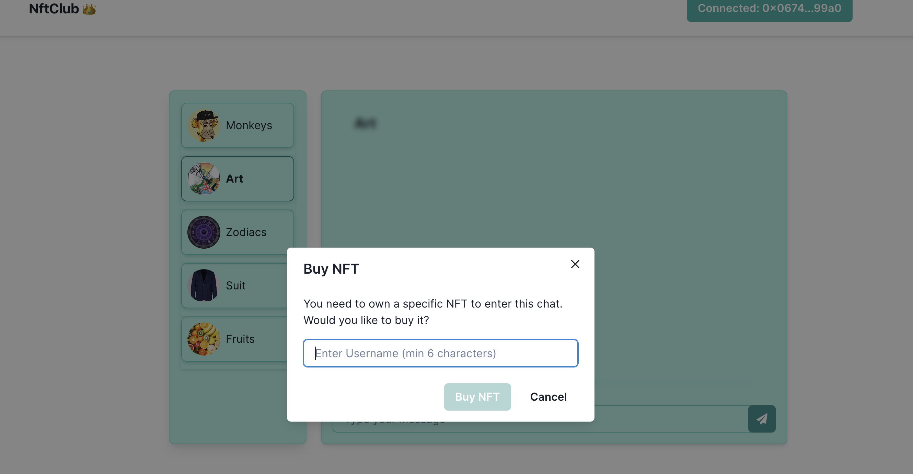
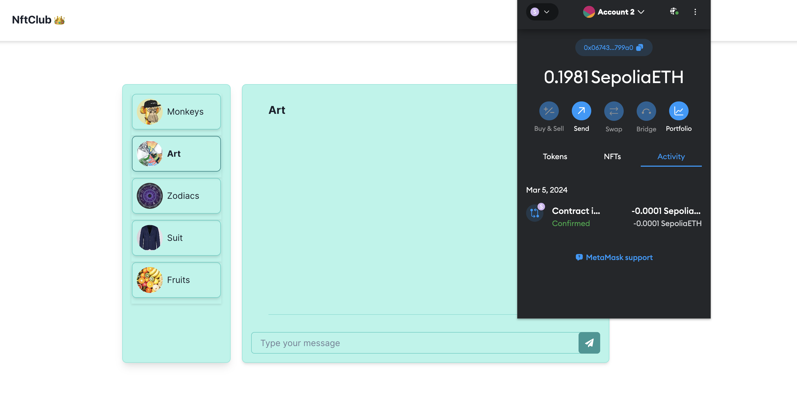

# NFT club members

NFT club members is a project that enables users who hold specific NFTs to be able to enter chats with other owners. Every chat has its own NFT to hold.

## To run locally in dev move

Run

```bash
cd  nft-club-next
npm run dev
```

The project uses **[Chakra ui kit](https://chakra-ui.com/)** with its **[Next.js](https://nextjs.org/)** compatibility. The backend was done in `Sepolia§ test network. if you don't have it configured in your wallet you will get an error. The front-end connects with the network via **[ethers.js](https://docs.ethers.org/v5/)**.

## Getting Started

First, run the development server:

```bash
npm run dev
```

Open [http://localhost:3000](http://localhost:3000) with your browser to see the result.

## Usage

In **localhost:3000/admin** you will see a form that lets the admin of the smart contract which is the account `0x006510FA9a9b5b0566209347200d3300081342f3` otherwise you will get an error

<p align="center"></p>

## Visuals

<p align="center"></p>

<p align="center"></p>

<p align="center"></p>

<p align="center"></p>

<p align="center"></p>

## Deploy on Vercel

I have deployed the front-end using Vercel
